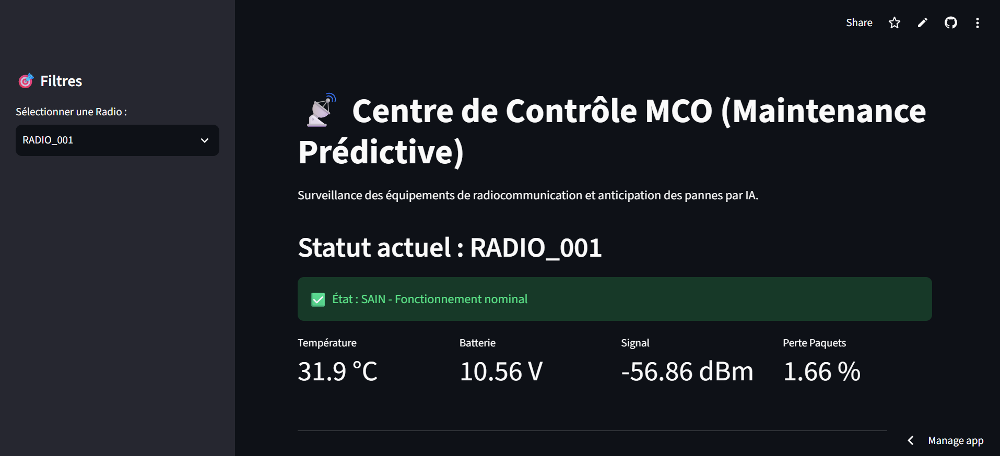

# 📡 POC : MCO & Maintenance Prédictive pour Systèmes Critiques



Copilote de supervision IA conçu pour anticiper les pannes des équipements de radiocommunication militaire. Il analyse les séries temporelles de télémétrie pour passer d'une maintenance réactive à une approche préventive et prédictive.

🚀 **[Démo live : Accéder au Centre de Contrôle MCO](https://radiocommunication-predictive-maintenance-bypharell9.streamlit.app/)**

---

## 🎯 Contexte & Motivation
Le Maintien en Condition Opérationnelle (MCO) des équipements de radiocommunication est un enjeu vital. Une panne sur le terrain entraîne une rupture de la continuité des missions. Ces équipements (radios, réseaux LAN, chiffreurs) génèrent des milliers de points de données sous-exploités.

Ce projet propose un tableau de bord intelligent qui surveille l'état de santé de la flotte et utilise le Machine Learning pour repérer les signaux faibles (surchauffe, perte de paquets, chute de tension) avant la panne.

* **Cas d'usage cible :** Industrie de la Défense et Télécommunications (équipes de soutien opérationnel cherchant à fiabiliser des systèmes critiques).
* **Statut du projet :** POC fonctionnel. L'architecture démontre la chaîne de valeur complète : Ingestion de données temporelles ➔ Inférence ML ➔ Visualisation d'aide à la décision.

---

## 🏗️ Architecture

```text
┌─────────────────────┐
│  Sondes Équipements │  Génération de télémétrie synthétique
│  (Radios tactiques) │  (Température, Batterie, Signal, Latence)
└──────────┬──────────┘
           │
           ▼
┌─────────────────────┐
│    generate_data.py │  Création du dataset 'telemetry_data.csv'
│                     │  (72 000 relevés horaires / 100 radios)
└──────────┬──────────┘
           │
           ▼
┌─────────────────────┐
│    Scikit-Learn     │  Entraînement : Random Forest Classifier
│   (train_model.py)  │  (Séparation 80% Train / 20% Test)
└──────────┬──────────┘
           │
           ▼
┌─────────────────────┐
│   Joblib (Export)   │  Modèle sérialisé : predictive_model.joblib
└──────────┬──────────┘
           │
           ▼   ┌─── Interface Utilisateur ───┐
           │   │                             │
           ▼   ▼                             │
┌─────────────────────┐                      │
│    Streamlit App    │ ◄────────────────────┘
│  (Dashboard MCO)    │  Radar global de la flotte (C2) + Filtres par radio, KPI temps réel
└──────────┬──────────┘
           │
           ▼
┌─────────────────────┐
│  Alertes & Graphes  │  Statut (Sain / Alerte / Panne) + Courbes
└─────────────────────┘

🚀 Stack technique
Composant,Choix technique,Justification
Génération Données,"Pandas, NumPy",Manipulation optimisée des DataFrames et calcul vectoriel
Machine Learning,Scikit-Learn (Random Forest),"Robuste, performant sur les données tabulaires, et interprétable (vital pour la Défense)"
Sérialisation,Joblib,Export léger du modèle pré-entraîné pour des inférences à faible latence
Interface (C2),"Streamlit, Plotly",Prototypage rapide d'un centre de contrôle avec visualisation dynamique des Time Series
💡 Pourquoi cette stack pour un passage en production ?

Interprétabilité : Contrairement au Deep Learning ("boîte noire"), les algorithmes ensemblistes comme Random Forest permettent d'extraire l'importance des variables (Feature Importance), aidant les techniciens à comprendre pourquoi l'IA alerte.

Séparation des préoccupations : Le modèle est entraîné hors ligne (train_model.py) et l'inférence est servie de manière indépendante (app.py), une architecture compatible avec un déploiement MLOps (via API FastAPI).

📂 Structure du projet
thales-predictive-maintenance/
├── generate_data.py          # Script de génération de la télémétrie (injection d'anomalies)
├── train_model.py            # Script d'entraînement et d'évaluation du Random Forest
├── app.py                    # Tableau de bord interactif (Streamlit)
├── telemetry_data.csv        # Dataset généré (72 000 relevés horaires)
├── predictive_model.joblib   # Modèle Machine Learning sérialisé
├── requirements.txt          # Dépendances Python
└── README.md                 # Documentation

🛠️ Installation & Exécution locale
Prérequis : Python 3.11+

1. Cloner le repository
git clone https://github.com/Pharell9/radiocommunication-predictive-maintenance.git
cd radiocommunication-predictive-maintenance
2. Environnement virtuel et dépendances
python -m venv venv
# Windows : venv\Scripts\activate | Mac/Linux : source venv/bin/activate
pip install -r requirements.txt
3. (Optionnel) Régénérer les données et réentraîner le modèle
python generate_data.py
python train_model.py
4. Lancer le tableau de bord
python -m streamlit run app.py

## 💬 Exemples de scénarios détectés

### 🔴 Scénario 1 — Dégradation batterie
Radio ALPHA-042 : baisse progressive de la tension batterie sur 6 semaines
(9,2 V → 7,4 V). Modèle : probabilité de panne 87% dans les 15 jours. 
Recommandation : remplacement préventif planifié.

### 🟠 Scénario 2 — Surchauffe environnementale
Radio DELTA-011 : température de fonctionnement anormale (58°C moyens
vs 42°C flotte). Cause probable : exposition solaire directe. 
Recommandation : inspection terrain sous 48h.

### 🟡 Scénario 3 — Perte de paquets réseau
Radio BRAVO-078 : latence x3 et perte de paquets 12% depuis 72h.
Cause probable : brouillage ou dégradation antenne. 
Recommandation : diagnostic terrain sous 7j.

### ✅ Scénario 4 — Faux positif écarté
Radio ECHO-025 : pic de température ponctuel (3h). Modèle : 
probabilité de panne 15% (pas d'alerte). Explication : profil dynamique 
compatible avec exercice terrain, pas dégradation matérielle.

## 📊 Résultats & Évaluation (Gestion du Paradoxe de l'Accuracy)

Dans un contexte militaire, les pannes sont rares et les capteurs sont soumis aux aléas du terrain. Pour refléter cette réalité, le jeu de données simule un **fort déséquilibre des classes** (seulement 5% de pannes) et intègre du **bruit statistique** (2% de glitchs et faux positifs).

* **Précision globale (Accuracy) : ~99.8 %**
* **Rappel (Recall) sur les pannes critiques : 100 %**
* **Rappel (Recall) sur les alertes précoces : ~27 %**

**Note technique :** L'Accuracy globale très élevée masque la difficulté de détecter les signaux faibles (les alertes précoces sont noyées dans le bruit des sondes). Pour forcer l'IA à traquer ces anomalies rares sans générer de fatigue d'alerte, le modèle utilise un rééquilibrage mathématique des poids (`class_weight="balanced"`). Le Rappel de 27% sur les alertes précoces illustre un modèle industriel sain : il doute face aux interférences légères, mais ne rate aucune panne critique.

⚠️ Limites actuelles
Limites de la modélisation (Data Science)

Absence de séquentialité temporelle : Le modèle actuel évalue le risque sur la base d'une observation à un instant T. Une approche par fenêtre glissante (Rolling Window) ou un modèle récurrent (LSTM) serait nécessaire pour capter la dynamique d'une dégradation.

* **Limites physiques des données synthétiques :** Bien que le jeu de données intègre du bruit statistique et des faux positifs pour simuler le terrain, il manque d'inertie physique. Par exemple, un pic de température redescend instantanément dans la simulation, alors qu'un vrai boîtier radio mettrait plusieurs heures à refroidir (thermodynamique).

Limites d'architecture (Data Engineering)

Inférence statique : L'application lit un fichier CSV statique. Dans un vrai centre de contrôle, les données arriveraient en flux continu (Data Streaming).

Pas de gestion MLOps : Le cycle de vie du modèle n'est pas versionné (absence d'outils comme MLflow).

🗺️ Roadmap & Améliorations futures
🎯 Priorité haute (v1.1 — Modélisation)

Implémentation d'une approche par séries temporelles avec création de variables retardées (lag features).

Ajout d'une analyse SHAP Values dans l'interface pour expliquer visuellement la décision de l'IA.

🎯 Priorité moyenne (v2.0 — Data Temps Réel)

Simulation d'un flux de données en continu via Apache Kafka ou un broker MQTT (protocole IoT industriel).

Bascule vers une base de données orientée séries temporelles (InfluxDB).

🎯 Priorité basse (v3.0 — MLOps)

Mise en place d'un pipeline d'entraînement automatisé avec MLflow.

Système de Webhook pour envoyer des alertes email/SMS aux techniciens d'astreinte.

👤 Auteur
Guy Pharell KAMGANG SIMO — Étudiant Ingénieur en Big Data & Intelligence Artificielle (ECE Paris)

📧 Email : pharellkamgang@gmail.com

🔗 LinkedIn : Guy Pharell KAMGANG SIMO

🐙 GitHub : @Pharell9

📜 Licence MIT. Fait pour explorer les applications de la Data Science dans le maintien en condition opérationnelle (MCO).
